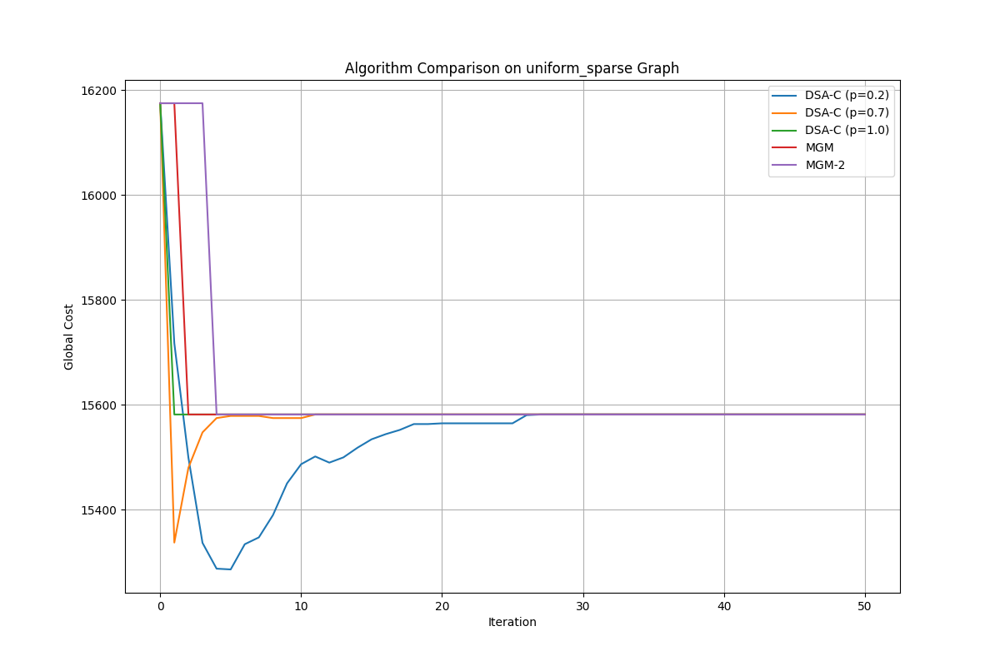
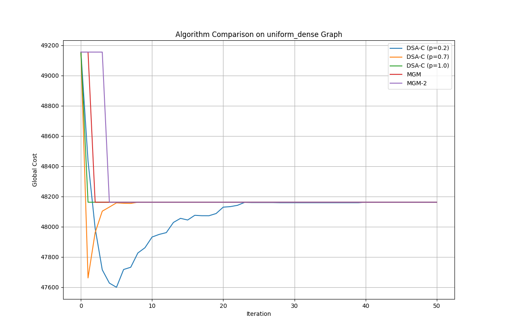
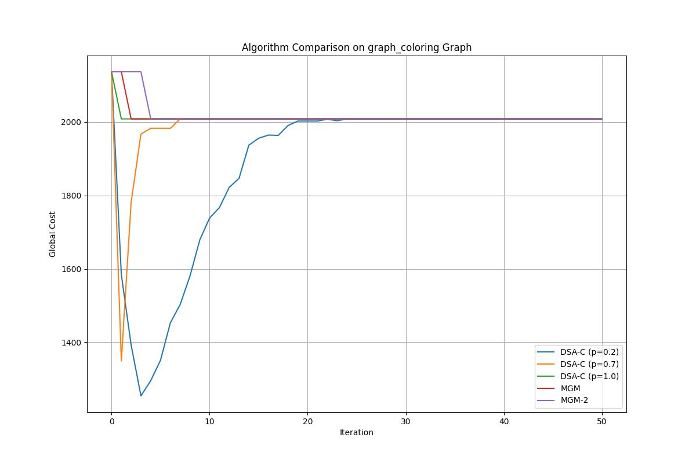

# דו"ח מסכם - אלגוריתמי חיפוש לוקלי מבוזרים
## מבוא

מטרת הפרויקט הייתה לממש ולהשוות שלושה סוגי אלגוריתמים לחיפוש לוקלי מבוזר לפתרון בעיות DCOP (Distributed Constraint Optimization Problems). המימוש כלל פיתוח סביבת סימולציה מודולרית המאפשרת לסוכנים לתקשר באופן מבוזר.

האלגוריתמים שמומשו:
1. **DSA-C** (Distributed Stochastic Algorithm) עם פרמטרים p=0.2, p=0.7, ו-p=1.0
2. **MGM** (Maximum Gain Message)
3. **MGM-2** (הרחבה של MGM המאפשרת שינויים מתואמים בין זוגות סוכנים)

הבעיות שנפתרו:
1. גרף אחיד רנדומלי עם צפיפות k=0.25 (דליל)
2. גרף אחיד רנדומלי עם צפיפות k=0.75 (צפוף)
3. בעיית צביעת גרף עם צפיפות k=0.1

## הגרפים והניתוח שלהם

### גרף 1: גרף אחיד רנדומלי דליל (k=0.25)

בגרף זה, עם צפיפות נמוכה של 0.25, ניתן לראות:

- כל האלגוריתמים משיגים התכנסות וירידה בעלות הגלובלית לאורך האיטרציות.
- **DSA-C עם p=0.2** מגיע למינימום מקומי משופר במקצת ביחס לאחרים. זה מתאים לתיאוריה שבמצבים דלילים, גישה יותר שמרנית (פחות שינויים) עשויה למנוע תנודות ולאפשר התכנסות טובה יותר.
- **MGM ו-MGM-2** מתכנסים מהר יותר באיטרציות הראשונות, אך מגיעים לפתרון פחות טוב. זה נובע מכך שהם תמיד עושים את השינויים המשפרים ביותר, אך עלולים להיתקע במינימום מקומי.
- אחרי כ-25 איטרציות, כל האלגוריתמים מתכנסים לפתרון יציב ולא משתפרים עוד.

### גרף 2: גרף אחיד רנדומלי צפוף (k=0.75)

בגרף זה, עם צפיפות גבוהה של 0.75, ניתן לראות:

- האלגוריתמים מתקשים יותר להגיע לפתרון טוב בגלל האילוצים המרובים.
- **DSA-C עם פרמטרים שונים** מציגים התנהגות שונה משמעותית:
  - p=0.2 מראה יותר תנודתיות אך מגיע לפתרון טוב יותר בסופו של דבר
  - p=1.0 מתכנס מהר אך נתקע במינימום מקומי פחות טוב
- **MGM-2** מראה ביצועים טובים יותר באיטרציות המאוחרות, ככל הנראה בזכות היכולת שלו לשנות ערכים בזוגות.
- צפיפות גבוהה מקשה על כל האלגוריתמים, והפער בעלות הסופית בין האלגוריתמים קטן יותר.

### גרף 3: צביעת גרף (k=0.1)

בבעיית צביעת הגרף עם צפיפות 0.1, ניתן לראות:

- כל האלגוריתמים מגיעים לפתרון אופטימלי (או קרוב לאופטימלי) עם עלות נמוכה מאוד, במקרים רבים אפילו עלות 0.
- בעיית צביעת גרף היא קלה יותר לרוב האלגוריתמים מכיוון שהמטרה פשוטה - להימנע מצבעים זהים בין שכנים.
- **DSA-C עם p=0.2** מתכנס איטי יותר אך בסופו של דבר מגיע לאותו פתרון כמו האחרים.
- לא ניכר יתרון משמעותי ל-MGM-2 בבעיה זו, ככל הנראה מכיוון שאילוצים בינאריים (צבע שונה/זהה) פשוטים יחסית לפתרון.

## הסבר על הבעיות וההבדלים ביניהם

### 1. גרף אחיד רנדומלי

בבעיות אלה, לכל זוג סוכנים יש עלות עבור כל צירוף ערכים אפשרי, כאשר העלויות הוגרלו בטווח 100-200 מהתפלגות אחידה. ההבדל העיקרי בין שני הגרפים האחידים הוא בצפיפות (הסתברות השכנות):

- **גרף דליל (k=0.25)**: רק 25% מהזוגות האפשריים הם שכנים.
- **גרף צפוף (k=0.75)**: 75% מהזוגות האפשריים הם שכנים.

גרף צפוף יותר מייצג בעיה מורכבת יותר עם יותר אילוצים, ולכן קשה יותר למצוא פתרון טוב.

### 2. בעיית צביעת גרף

בבעיה זו המטרה היא לצבוע את הגרף כך שצמתים סמוכים לא יקבלו אותו צבע. מודל העלויות מגדיר:
- עלות גבוהה (100-200) לשכנים עם אותו צבע
- עלות 0 לשכנים עם צבעים שונים

צפיפות נמוכה של k=0.1 אומרת שרק 10% מהזוגות האפשריים הם שכנים, מה שהופך את הבעיה לקלה יחסית.

## סיכום והמסקנות

מהתוצאות ניתן להסיק מספר מסקנות:

1. **השפעת הפרמטר p ב-DSA-C**:
   - p נמוך (0.2) מוביל להתכנסות איטית יותר אך לעתים יציבה יותר
   - p גבוה (1.0) מוביל להתכנסות מהירה יותר אך עלול להיתקע במינימום מקומי
   - הערך האופטימלי של p תלוי בצפיפות הגרף ובמבנה הבעיה

2. **השוואת MGM ו-MGM-2**:
   - MGM מתכנס מהר יותר בשלבים הראשונים
   - MGM-2 יכול להגיע לפתרונות טובים יותר באיטרציות מאוחרות, בעיקר בגרפים צפופים
   - המורכבות הנוספת של MGM-2 לא תמיד מוצדקת בבעיות פשוטות

3. **השפעת צפיפות הגרף**:
   - צפיפות גבוהה מקשה על כל האלגוריתמים
   - בבעיות צפופות, חשוב יותר המנגנון של תיאום בין סוכנים (כמו ב-MGM-2)
   - בבעיות דלילות, יעילות פשוטה יותר של DSA יכולה להספיק

4. **מאפיינים כלליים**:
   - כל האלגוריתמים מצליחים להתכנס לפתרון טוב יחסית תוך ~30 איטרציות
   - DSA מציג יותר תנודתיות בעלות לאורך האיטרציות לעומת MGM
   - אלגוריתמים לא-דטרמיניסטיים (כמו DSA) יכולים לעזור להימנע ממינימום מקומי

האלגוריתמים הללו מציגים איזון מעניין בין פשטות המימוש (DSA), מונוטוניות בשיפור (MGM) ויכולת למצוא פתרונות טובים יותר (MGM-2). הבחירה ביניהם תלויה בדרישות הספציפיות של הבעיה, כולל מורכבות הפתרון, זמן התגובה הנדרש ואיכות הפתרון הנדרשת.

בסך הכל, המימוש הצליח להדגים את היתרונות והחסרונות של אלגוריתמים אלה בבעיות שונות, ומספק בסיס לבחירה מושכלת של אלגוריתם מתאים לבעיות DCOP מעשיות.
